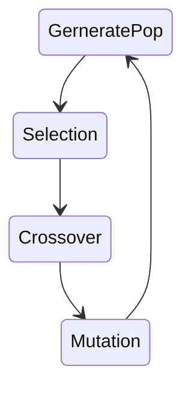

# Snake Ai with Genetic Algorithm
From **Charles Darwin's theory** + **Pygame** and now it become to Snake Ai.

# Running
run app.py

Or if you need customize go to play around with setting.py. You can setup both of neural net property and genetic algo property also,and make sure that you're setting **use_pretrained = Flase**,

For faster training process can go to check with pseudo_training similar setting but no rendering.
# Pipeline

